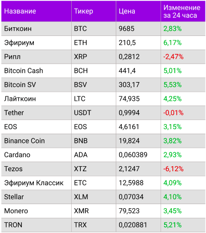

# Javascript Dom Table task

## Şəkildə görünən table hazırlanmalıdır.

Html və [CSS (şəkildəki css)]("./style.css") ixtiyaridir.(Lakin "nice design" olmalıdır).
Table-da görünən məlumatlar [data]("./data.js") faylından oxunub table-a yığılmalıdır.

### Önəmli məqamlar :

```change property'də olan dəyəri table-a yazdırarkən əgər dəyər mənfidirsə rəngi qırmızı,
yox əgər müsbtdirsə rəngi yaşıl olmalıdır.(rənglər ixtiyaridir)
Table'da axtarış etmək kimi bir özəllik əlavə edilməlidir.
İstifadəçi axtarışı həm name, həm də ticker  özəlliyinə əsasən edə bilməlidir.
Table'da məlumatları sort etmək xüsusiyyəti əlavə edilməlidir.
İstifadəçi table'da name'ə click etdiyi zaman table-dakı məlumatlar A-Z düzülməlidir,
növbəti clickdə isə Z-A düzülməlidir və əməliyyat bu formada ardbaard davam etməlidir.
```

### ARAŞDIRILMALI OLAN MÖVZULAR:

- Array filter method( search üçün)
- Array sort method( sıralama üçün)
- Array forEach method( məlumatları table-a yığmaq üçün)


